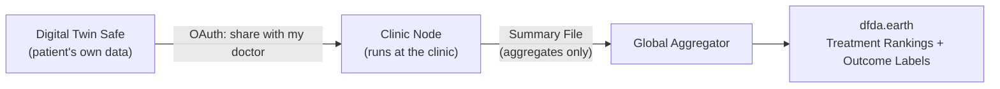

> **dFDA (Decentralized Framework for Drug Assessment)** is open-source software for ranking treatments by real-world outcomes and publishing an Outcome Label for each one. It is designed so patient records stay with patients and clinics and only aggregate results are shared; that sharing isn't built yet (see What works today below). It is an independent open-source project, not affiliated with, endorsed by, or acting on behalf of the U.S. Food and Drug Administration.


```mermaid
flowchart LR
  SAFE["Digital Twin Safe<br/>(patient's own data)"] -- "OAuth: share with my doctor" --> NODE["Clinic Node<br/>(runs at the clinic)"]
  NODE -- "Summary File<br/>(aggregates only)" --> AGG["Global Aggregator"]
  AGG --> SITE["dfda.earth<br/>Treatment Rankings + Outcome Labels"]
```

**What works today**

| Piece | Status | Where |
| --- | --- | --- |
| Web app | Prototype: patient condition and treatment tracking, 0–10 treatment ratings, outcome-label schema. Runs as dfda.earth or as a clinic's Clinic Node. No federation yet. | [`apps/web`](apps/web) |
| N-of-1 causal analysis engine | Working TypeScript library | [`optimitron/packages/optimizer`](https://github.com/mikepsinn/optimitron/tree/main/packages/optimizer) |
| Patient ratings | Live for 162 conditions and ~3,900 treatments, reported by patients | [crowdsourcingcures.org/conditions](https://www.crowdsourcingcures.org/conditions) |
| Automated N-of-1 studies | ~15,800 legacy observational analyses, not peer reviewed | [studies.crowdsourcingcures.org](https://studies.crowdsourcingcures.org) |
| Summary File spec, Codebook, Global Aggregator | Designed, not built yet | — |

See [Apps and features](docs/APPS-AND-FEATURES.md) for the current application, planned packages, and features to extract from related repositories. The implementation sequence and data rules are in [docs/MIGRATION.md](docs/MIGRATION.md), the authoritative implementation roadmap. The broader vision below is background, not a second backlog or a claim that every feature exists.

# 💖 OBJECTIVE: MAXIMUM CURE ACCELERATION

Billions of people are suffering needlessly because the current system of clinical research, diagnosis, and treatment sucks because:

* ⏳ **Counterproductive Regulatory Barriers** to clinical research block life-saving treatments by 7-12 years
* 🚫 **97% of patients** are excluded from clinical trials
* 💰 **Drug development costs** of $2.6B are passed on to patients
* ⏱️ **Terminal patients** wait 4+ years for breakthrough therapy approvals
* 📊 The system ignores **real-world evidence** about effective treatments

## 💡 The Solution

The Cure Acceleration Act creates:

* ✅ **Universal Trial Access** - Every person's right to try safe treatments
* 🤖 **dFDA (Decentralized Framework for Drug Assessment)** - Free, open infrastructure for real-world evidence collection
* 🏆 **50/50 Health Savings Sharing Rewards** - Multi-billion dollar incentives for developing actual cures instead of lifetime drug subscriptions
* 📈 **Real-Time Analysis** of the positive and negative effects of every food, supplement, drug, and treatment on every measurable aspect of human health and happiness
* 🌐 **Global Access** - Decentralized trials anyone can participate in from home

[👉 Read the Full Cure Acceleration Act](https://www.crowdsourcingcures.org/docs/cure-acceleration-act)

# 😕 Why are we doing this?

The current system of clinical research, diagnosis, and treatment is failing the billions of people are suffering from chronic diseases.

[👉 Problems we're trying to fix...](https://www.crowdsourcingcures.org/docs/01-problem)

# 🧪 Our Hypothesis

By harnessing global collective intelligence and oceans of real-world data, we hope to emulate Wikipedia's speed of knowledge generation.

<!--suppress CheckImageSize, HtmlDeprecatedAttribute -->
<details>
  <summary>👉 How to generate discoveries 50X faster and 1000X cheaper than current systems...</summary>

## Global Scale Clinical Research + Collective Intelligence = 🤯

So in the 90's, Microsoft spent billions hiring thousands of PhDs to create Encarta, the greatest encyclopedia in history.  A decade later, when Wikipedia was created, the general consensus was that it was going to be a dumpster fire of lies.  Surprisingly, Wikipedia ended up generating information 50X faster than Encarta and was about 1000X cheaper without any loss in accuracy.  This is the magical power of crowdsourcing and open collaboration.

Our crazy theory is that we can accomplish the same great feat in the realm of clinical research.  By crowdsourcing real-world data and observations from patients, clinicians, and researchers, we hope to generate clinical discoveries 50X faster and 1000X cheaper than current systems.

## The Potential of Real-World Evidence-Based Studies

- **Diagnostics** - Data mining and analysis to identify causes of illness
- **Preventative medicine** - Predictive analytics and data analysis of genetic, lifestyle, and social circumstances
  to prevent disease
- **Precision medicine** - Leveraging aggregate data to drive hyper-personalized care
- **Medical research** - Data-driven medical and pharmacological research to cure disease and discover new treatments and medicines
- **Reduction of adverse medication events** - Harnessing of big data to spot medication errors and flag potential
  adverse reactions
- **Cost reduction** - Identification of value that drives better patient outcomes for long-term savings
- **Population health** - Monitor big data to identify disease trends and health strategies based on demographics,
  geography, and socioeconomic

</details>

# 🖥️  Framework Components

This is a very high-level overview of the architecture. The three primary primitive components of the framework are:

1. [Data Silo API Gateway Nodes](#1-data-silo-api-gateway-nodes) that facilitate data export from data silos
2. [Digital Twin Safes](#2-digital-twin-safes) that import, store, and analyze your data to identify how various factors affect your health
3. [Clinipedia](#3-clinipediathe-wikipedia-of-clinical-research) that contains the aggregate of all available data on the effects of every food, drug, supplement, and medical intervention on human health.


## 1. Data Silo API Gateway Nodes


[Gateway API Nodes](https://www.crowdsourcingcures.org/docs/components/data-silo-gateway-api-nodes/data-silo-api-gateways) should make it easy for data silos, such as hospitals and digital health apps, to let people export and save their data locally in their [Digital Twin Safes](#2-digital-twin-safes).

**👉 [Learn More About Gateway APIs](https://www.crowdsourcingcures.org/docs/components/data-silo-gateway-api-nodes/data-silo-api-gateways)**

## 2. Digital Twin Safes

[Digital Twin Safes](https://www.crowdsourcingcures.org/docs/components/personal-fda-nodes/personal-fda-nodes) are applications that can run on your phone or computer. They import, store, and analyze your data to identify how various factors affect your health.  They can also be used to share anonymous analytical results with the [Clinipedia FDAi Wiki](#3-clinipediathe-wikipedia-of-clinical-research) in a secure and privacy-preserving manner.

Each [Digital Twin Safe](https://www.crowdsourcingcures.org/docs/components/personal-fda-nodes/personal-fda-nodes) combines [encrypted local storage](https://www.crowdsourcingcures.org/docs/components/digital-twin-safe/digital-twin-safe) with a [personal AI agent](https://www.crowdsourcingcures.org/docs/components/optimiton-ai-agent/optomitron-ai-agent) that applies causal inference algorithms to estimate how various factors affect your health.

### 2.1. Digital Twin Safes


A local application for self-sovereign import and storage of personal data.

**👉[Learn More or Contribute to Digital Twin Safe](https://www.crowdsourcingcures.org/docs/components/digital-twin-safe/digital-twin-safe)**

### 2.2. Personal AI Agents

[Personal AI agents](https://www.crowdsourcingcures.org/docs/components/optimiton-ai-agent/optomitron-ai-agent) that live in your [Digital Twin Safe](https://www.crowdsourcingcures.org/docs/components/personal-fda-nodes/personal-fda-nodes) and use [causal inference](https://www.crowdsourcingcures.org/docs/components/optimiton-ai-agent/optomitron-ai-agent) to estimate how various factors affect your health.


**👉[Learn More](https://www.crowdsourcingcures.org/docs/components/optimiton-ai-agent/optomitron-ai-agent)**


## 3. Clinipedia—The Wikipedia of Clinical Research


The [Clinipedia wiki](https://www.crowdsourcingcures.org/docs/components/clinipedia/clinipedia) should be a global knowledge repository containing the aggregate of all available data on the effects of every food, drug, supplement, and medical intervention on human health.

**[👉 Learn More or Contribute to the Clinipedia](https://www.crowdsourcingcures.org/docs/components/clinipedia/clinipedia)**

### 3.1 Outcome Labels

A key component of Clinipedia is [**Outcome Labels**](https://www.crowdsourcingcures.org/docs/components/outcome-labels/outcome-labels) that list the degree to which the product is likely to improve or worsen specific health outcomes or symptoms.


**👉 [Learn More About Outcome Labels](https://www.crowdsourcingcures.org/docs/components/outcome-labels/outcome-labels)**


### Features


* [Data Collection](https://www.crowdsourcingcures.org/docs/components/data-collection/data-collection)
* [Data Import](https://www.crowdsourcingcures.org/docs/components/data-import/data-import)
* [Data Analysis](#data-analysis)
    * [🏷️Outcome Labels](#-outcome-labels)
    * [🔮Predictor Search Engine](https://www.crowdsourcingcures.org/docs/components/predictor-search-engine/predictor-search-engine)
    * [🥕 Root Cause Analysis Reports](https://www.crowdsourcingcures.org/docs/components/root-cause-analysis-reports/root-cause-analysis-reports)
    * [📜Observational Mega-Studies](https://www.crowdsourcingcures.org/docs/components/observational-studies/observational-studies)
* [Real-Time Decision Support Notifications](https://www.crowdsourcingcures.org/docs/components/decision-support-notifications/decision-support-notifications)
* [No Code Health App Builder](https://www.crowdsourcingcures.org/docs/components/no-code-app-builder/no-code-app-builder)
* [Personal AI Agent](https://www.crowdsourcingcures.org/docs/components/optimiton-ai-agent/optomitron-ai-agent)
* [Browser Extension](https://www.crowdsourcingcures.org/docs/components/browser-extension/browser-extension)

<p align="center">


&nbsp
</p>
<p align="center">
  
</p>

Collects and aggregate data on symptoms, diet, sleep, exercise, weather, medication, and anything else from dozens
of life-tracking apps and devices. Analyzes data to reveal hidden factors exacerbating or improving symptoms of
chronic illness.

### Web Notifications

Web and mobile push notifications with action buttons.


### Browser Extensions

By using the Browser Extension, you can track your mood, symptoms, or any outcome you want to optimize in a fraction of a second using a unique popup interface.


### Data Analysis

The Analytics Engine performs temporal precedence accounting, longitudinal data aggregation, erroneous data filtering, unit conversions, ingredient tagging, and variable grouping to quantify correlations between symptoms, treatments, and other factors.

It then pairs every combination of variables and identifies likely causal relationships using correlation mining algorithms in conjunction with a pharmacokinetic model.  The algorithms first identify the onset delay and duration of action for each hypothetical factor. It then identifies the optimal daily values for each factor.

[👉 More info about data analysis](https://www.crowdsourcingcures.org/docs/components/data-analysis/data-analysis)


### Real-time Decision Support Notifications


[More info about real time decision support](https://www.crowdsourcingcures.org/docs/components/outcome-labels/outcome-labels)

### 📈 Predictor Search Engine

[](https://www.crowdsourcingcures.org/docs/components/predictor-search-engine/predictor-search-engine)

[👉 More info about the predictor search engine...](https://www.crowdsourcingcures.org/docs/components/predictor-search-engine/predictor-search-engine)

### Auto-Generated Observational Studies


[👉 More info about observational studies...](https://www.crowdsourcingcures.org/docs/components/observational-studies/observational-studies)


## Key Components

### Applications (apps/)

| App | Status | Description |
|-----|--------|-------------|
| [`web`](apps/web) | **Canonical product** | The dFDA web app: patient, provider and research-partner screens, and public condition, treatment and outcome-label pages. The same code runs as dfda.earth, hosting people's Digital Twin Safes, or at a clinic as its Clinic Node. Each deployment has its own configuration, authentication, storage, and patient data. `prototype.dfda.earth` is the reference deployment. |

The Crowdsourcing Cures site has its own repository. The retired `fda-gov-v2` repository is a feature source for `apps/web`, not a
second product line. Port useful behavior in reviewed slices; do not merge its
entire divergent history into this repository.


### Packages (packages/)

| Package | Purpose |
| --- | --- |
| [`legacy-import`](packages/legacy-import) | Tools for moving data out of the legacy MySQL database: its Prisma schema, query CLIs, and a MySQL-to-PostgreSQL sync. Retired once the migration is done. |
| `config-eslint`, `config-typescript` | Shared lint and TypeScript config |

The planned shared packages are listed in [docs/MIGRATION.md](docs/MIGRATION.md).


## Technology Stack

- **Frontend**: React, Next.js, TypeScript, Tailwind
- **Canonical node database**: PostgreSQL through Supabase, with Row Level Security and SQL migrations
- **Legacy data**: a Prisma schema of the old MySQL database in `packages/legacy-import`, used only for the migration
- **Authentication**: Supabase Auth, plus the web app's own OAuth server for third-party apps
- **Background jobs**: graphile-worker
- **Tooling**: pnpm workspaces, Turborepo, Vitest, Playwright, GitHub Actions


## Getting Started

### Prerequisites

- Node.js 22+
- pnpm
- Docker (for the local Supabase stack)
- Supabase CLI


### Installation

1. Clone the repository:

```shellscript
git clone https://github.com/mikepsinn/dfda.git dfda
cd dfda
```


2. Install dependencies:

```shellscript
pnpm install
```


3. Set up environment variables:

```shellscript
cp apps/web/.env.example apps/web/.env
# Edit apps/web/.env with your Supabase credentials
```


4. Start the web app:

```shellscript
pnpm --filter web dev:env
```

This starts local Supabase (it needs Docker), then the Next.js server, the background worker (`dev:worker`) and the reminder cron (`dev:cron`). `dev:next` starts only the Next.js server, and `dev` starts it with secrets from Doppler instead of `.env`.

5. The first time, load the database schema and seed data from a second terminal:

```shellscript
pnpm --filter web db:local:reset
```

### Database Setup

The web app uses Supabase for its database and authentication. From the repo root:

```bash
pnpm --filter web sb:local:start   # start only local Supabase
pnpm --filter web db:local:reset   # apply migrations and seeds
pnpm --filter web db:local:types   # regenerate TypeScript types
```

The database schema is managed through migrations in the `apps/web/supabase/migrations` directory. Each migration represents a specific change to the database structure.

### Development Environment

The development environment includes:

- A local Supabase stack (PostgreSQL, Auth, Storage) started by `sb:local:start`
- A graphile-worker process for reminders and background jobs (`dev:worker`)
- A cron process that queues the periodic reminder jobs (`dev:cron`)


## Development Workflow

### Monorepo Structure

The repo uses pnpm workspaces and Turborepo, with the following structure:

```plaintext
dfda/
├── apps/           # Deployable applications (web)
├── packages/       # Shared libraries and tooling
├── schema/         # Earlier, unapplied database design
├── supabase/       # Earlier combined-migration tooling
├── docs/           # Documentation
└── .github/        # GitHub workflows
```

### Commands

- `pnpm --filter web dev:env` - Start the web app with local Supabase, the worker and the cron
- `pnpm --filter web build` - Build it
- `pnpm --filter web test` - Run its tests
- `pnpm --filter web lint` - Lint it


### Adding New Features

1. Place the feature in `apps/web` or a shared package according to [the migration plan](docs/MIGRATION.md)
2. Create a new branch: `feature/your-feature-name`
3. Implement the feature following the architectural guidelines
4. Add tests and documentation
5. Submit a pull request


## Deployment

The reference web app deploys to Vercel from `apps/web`, using Supabase Cloud
for its database and authentication. See the [app environment setup](apps/web/README.md#environment-setup)
for configuration.

Packaging the same app so a clinic can install and operate its own isolated
Clinic Node is planned work. Follow the [migration plan](docs/MIGRATION.md#order);
there is no separate infrastructure deployment roadmap here.

Before nodes share data, implement consent records, authenticated node
submissions, and the [aggregate privacy controls](docs/MIGRATION.md#rules-for-published-numbers).
Public pages remain in `apps/web`; network administration belongs to the
planned aggregator.

## Contributing

Use the development workflow above and the [migration plan](docs/MIGRATION.md)
to choose and scope a contribution.

### Key Areas for Contribution

- Tested analysis methods and trial-results ingestion
- Patient tracking, OAuth/data imports, and shared export parsers
- Consent, privacy-preserving Summary Files, and node authentication
- Clinic Node packaging and aggregator administration
- Documentation, internationalization, and accessibility

## Roadmap

Follow the [implementation sequence](docs/MIGRATION.md#order): foundation,
ratings and trial results, the dfda.earth cutover, the clinic network, and
consent-based legacy migration. The [feature inventory](docs/APPS-AND-FEATURES.md)
distinguishes existing code from extraction candidates and new work.

## Key Features

### For Patients

- Discover trials matched to your health profile
- Securely store and control your health data
- Track your participation and outcomes
- Receive personalized insights and recommendations


### For Sponsors

- Create and manage decentralized trials
- Access diverse patient populations
- Reduce administrative overhead
- Analyze real-time trial data


### For Providers

- Refer patients to appropriate trials
- Monitor patient participation
- Access comparative effectiveness data
- Integrate with existing EHR systems


### For Developers

- Build on the dFDA API platform
- Create specialized tools for clinical research
- Integrate with Gateway Nodes
- Preserve consent, access controls, and evidence provenance
