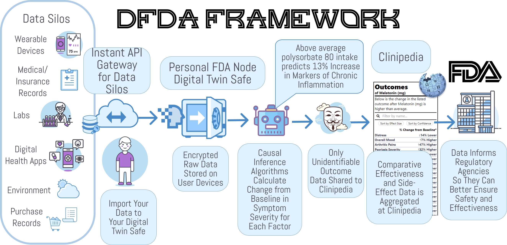
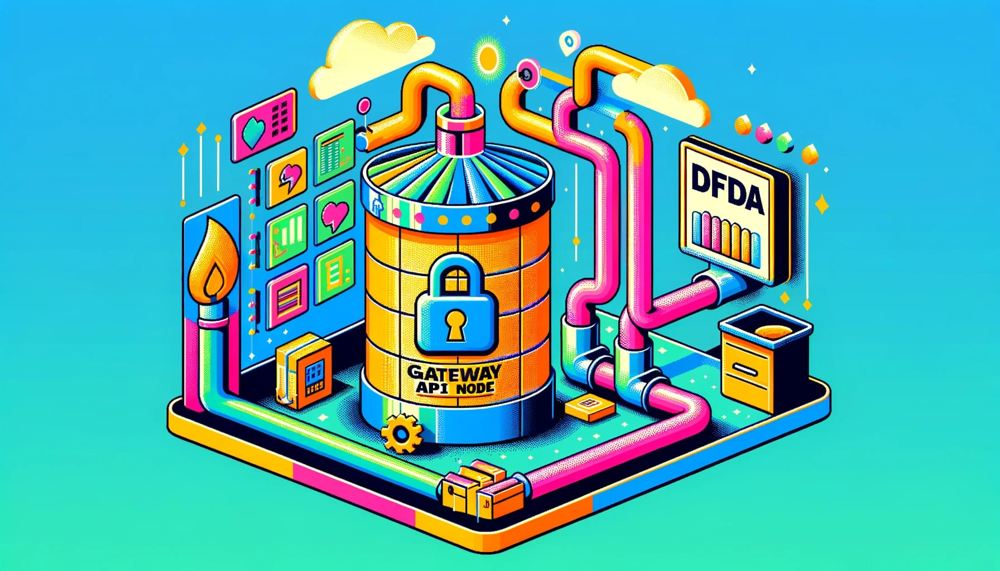
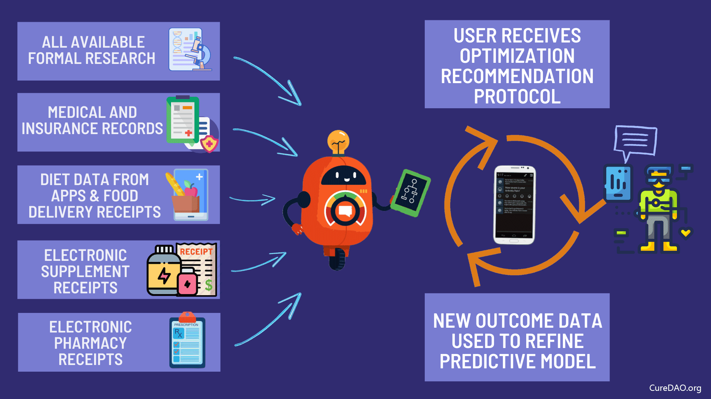
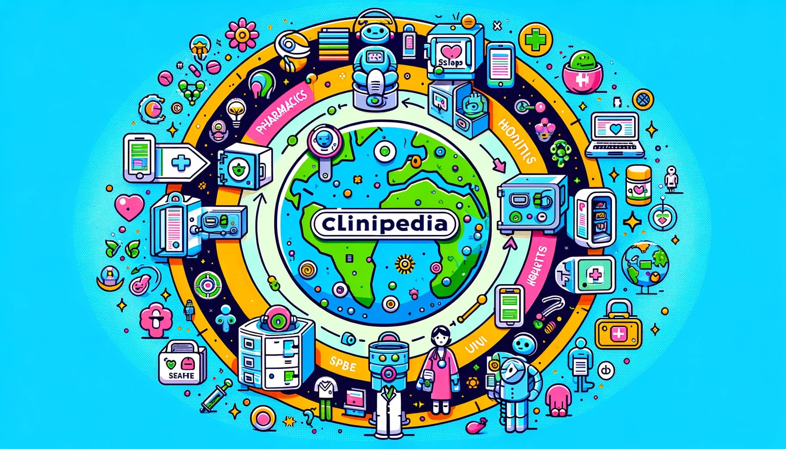
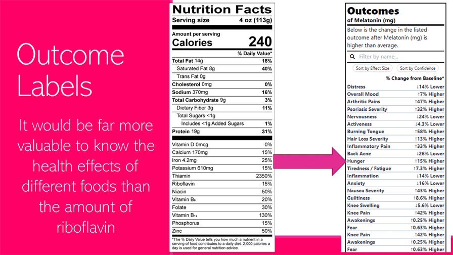
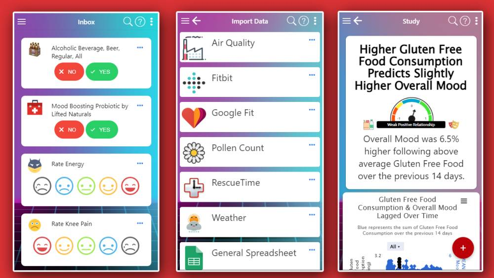
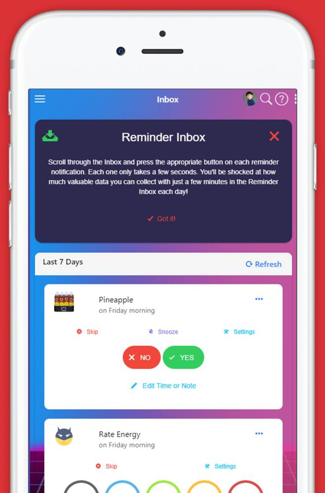
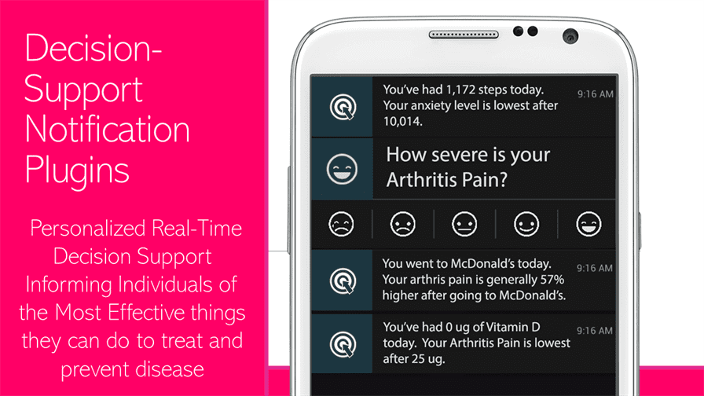
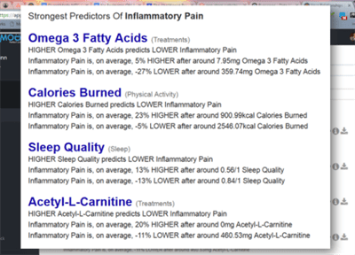
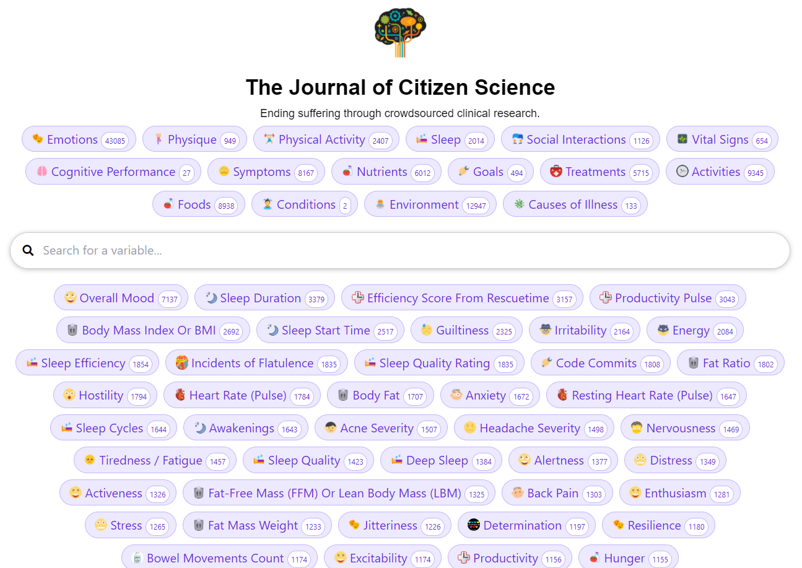

# Here's the Deal Folks

**[2 billion](https://www.who.int/news-room/fact-sheets/detail/noncommunicable-diseases)** people are suffering from chronic diseases. **[95%](https://globalgenes.org/rare-facts/)** of diseases have no FDA-approved treatment. The **[$2.4 billion](https://www.semanticscholar.org/paper/Innovation-in-the-pharmaceutical-industry%3A-New-of-DiMasi-Grabowski/3275f31c072ac11c6ca7a5260bd535720f07df41)** cost of developing a drug prevents treatments from being developed. We haven't cured a single disease in over 40 years, because lifelong drug subscriptions are more profitable. **[85%](https://www.clinicalleader.com/doc/getting-a-handle-on-clinical-trial-costs-0001)** of patients are unable to participate in clinical trials due to exclusion criteria, distance, or regulatory reasons. Even when a treatment is developed, it can take over **[17 years](https://pmc.ncbi.nlm.nih.gov/articles/PMC3241518/)** before it's generally available to patients due to regulatory and other delays.

# The Solution: 20X the Rate of Disase Eradication by Upgrading FDA.gov

We would like to upgrade FDA.gov into a global decentralized clinical trial platform that allows any patient to:

1. Enter their condition
2. See the most effective treatments based on clinical data and real-world evidence
3. Click to join a trial and get treatment shipped to them
4. Get lab tests automatically scheduled and report outcomes through forms or automated surveys
5. Anonymously share their data to eternally improve treatment effectiveness rankings

Through automation and increased efficiency, this would reduce treatment development costs by **[95%](https://www.dfda.earth/#cost-savings)** and result in a **[20X acceleration](https://www.dfda.earth/#cost-savings)** in the rate of curing disease.

---

#💖 The World We Live In

Billions of people are suffering needlessly because the current system of clinical research, diagnosis, and treatment sucks because:

* ⏳ Patients suffer and die for 
* 🚫 **97% of patients** are excluded from clinical trials
* 💰 **Drug development costs** of $2.6B are passed on to patients
* ⏱️ **Terminal patients** wait 4+ years for breakthrough therapy approvals
* 📊 The system ignores **real-world evidence** about effective treatments

## 💡 The Solution

The Disease Eradication Act creates:

* ✅ **Universal Trial Access** - Every person's right to try safe treatments
* 🤖 **Decentralized Autonomous FDA** - Free, open infrastructure for real-world evidence collection
* 🏆 **50/50 Health Savings Sharing Rewards** - Multi-billion dollar incentives for developing actual cures instead of lifetime drug subscriptions
* 📈 **Real-Time Analysis** of the positive and negative effects of every food, supplement, drug, and treatment on every measurable aspect of human health and happiness
* 🌐 **Global Access** - Decentralized trials anyone can participate in from home

[👉 Read the Full Disease Eradication Act](public/docs/disease-eradication-act.md)

# 😕 Why are we doing this?

The current system of clinical research, diagnosis, and treatment is failing the billions of people are suffering from chronic diseases.

[👉 Problems we're trying to fix...](public/docs/01-problem.md)

# 🧪 Our Hypothesis

By harnessing global collective intelligence and oceans of real-world data, we hope to emulate Wikipedia's speed of knowledge generation.

<!--suppress CheckImageSize, HtmlDeprecatedAttribute -->
<details>
  <summary>👉 How to generate discoveries 50X faster and 1000X cheaper than current systems...</summary>

## Global Scale Clinical Research + Collective Intelligence = 🤯

So in the 90's, Microsoft spent billions hiring thousands of PhDs to create Encarta, the greatest encyclopedia in history.  A decade later, when Wikipedia was created, the general consensus was that it was going to be a dumpster fire of lies.  Surprisingly, Wikipedia ended up generating information 50X faster than Encarta and was about 1000X cheaper without any loss in accuracy.  This is the magical power of crowdsourcing and open collaboration.

Our crazy theory is that we can accomplish the same great feat in the realm of clinical research.  By crowdsourcing real-world data and observations from patients, clinicians, and researchers, we hope to generate clinical discoveries 50X faster and 1000X cheaper than current systems.

## The Potential of Real-World Evidence-Based Studies

- **Diagnostics** - Data mining and analysis to identify causes of illness
- **Preventative medicine** - Predictive analytics and data analysis of genetic, lifestyle, and social circumstances
  to prevent disease
- **Precision medicine** - Leveraging aggregate data to drive hyper-personalized care
- **Medical research** - Data-driven medical and pharmacological research to cure disease and discover new treatments and medicines
- **Reduction of adverse medication events** - Harnessing of big data to spot medication errors and flag potential
  adverse reactions
- **Cost reduction** - Identification of value that drives better patient outcomes for long-term savings
- **Population health** - Monitor big data to identify disease trends and health strategies based on demographics,
  geography, and socioeconomic

</details>

# 🖥️  Framework Components

This is a very high-level overview of the architecture. The three primary primitive components of the framework are:

1. [Data Silo API Gateway Nodes](#1-data-silo-api-gateway-nodes) that facilitate data export from data silos
2. [PersonalFDA Nodes](#2-personalfda-nodes) that import, store, and analyze your data to identify how various factors affect your health
3. [Clinipedia](#3-clinipediathe-wikipedia-of-clinical-research) that contains the aggregate of all available data on the effects of every food, drug, supplement, and medical intervention on human health.



## 1. Data Silo API Gateway Nodes



[Gateway API Nodes](public/docs/components/data-silo-gateway-api-nodes) should make it easy for data silos, such as hospitals and digital health apps, to let people export and save their data locally in their [PersonalFDA Nodes](#2-personalfda-nodes).

**👉 [Learn More About Gateway APIs](public/docs/components/data-silo-gateway-api-nodes/data-silo-api-gateways.md)**

## 2. PersonalFDA Nodes

[PersonalFDA Nodes](public/docs/components/personal-fda-nodes/personal-fda-nodes.md) are applications that can run on your phone or computer. They import, store, and analyze your data to identify how various factors affect your health.  They can also be used to share anonymous analytical results with the [Clinipedia FDAi Wiki](#3-clinipediathe-wikipedia-of-clinical-research) in a secure and privacy-preserving manner.

[PersonalFDA Nodes](public/docs/components/personal-fda-nodes/personal-fda-nodes.md) are composed of two components, a [Digital Twin Safe](public/docs/components/digital-twin-safe/digital-twin-safe.md) and a [personal AI agent](public/docs/components/optimiton-ai-agent/optomitron-ai-agent.md) applies causal inference algorithms to estimate how various factors affect your health.

### 2.1. Digital Twin Safes


A local application for self-sovereign import and storage of personal data.

**👉[Learn More or Contribute to Digital Twin Safe](public/docs/components/digital-twin-safe/digital-twin-safe.md)**

### 2.2. Personal AI Agents

[Personal AI agents](public/docs/components/optimiton-ai-agent/optomitron-ai-agent.md) that live in your [PersonalFDA nodes](public/docs/components/personal-fda-nodes/personal-fda-nodes.md) and use [causal inference](public/docs/components/optimiton-ai-agent/optomitron-ai-agent.md) to estimate how various factors affect your health.

[](public/docs/components/optimiton-ai-agent/optomitron-ai-agent.md)

**👉[Learn More](public/docs/components/optimiton-ai-agent/optomitron-ai-agent.md)**


## 3. Clinipedia—The Wikipedia of Clinical Research

[](public/docs/components/clinipedia/clinipedia.md)

The [Clinipedia wiki](public/docs/components/clinipedia/clinipedia.md) should be a global knowledge repository containing the aggregate of all available data on the effects of every food, drug, supplement, and medical intervention on human health.

**[👉 Learn More or Contribute to the Clinipedia](public/docs/components/clinipedia/clinipedia.md)**

### 3.1 Outcome Labels

A key component of Clinipedia is [**Outcome Labels**](public/docs/components/outcome-labels/outcome-labels.md) that list the degree to which the product is likely to improve or worsen specific health outcomes or symptoms.



**👉 [Learn More About Outcome Labels](public/docs/components/outcome-labels/outcome-labels.md)**


### Features

* [Data Collection](public/docs/components/data-collection/data-collection.md)
* [Data Import](public/docs/components/data-import/data-import.md)
* [Data Analysis](#data-analysis)
   * [🏷️Outcome Labels](#-outcome-labels)
   * [🔮Predictor Search Engine](public/docs/components/predictor-search-engine/predictor-search-engine.md)
   * [🥕 Root Cause Analysis Reports](public/docs/components/root-cause-analysis-reports/root-cause-analysis-reports.md)
   * [📜Observational Mega-Studies](public/docs/components/observational-studies/observational-studies.md)
* [Real-Time Decision Support Notifications](public/docs/components/decision-support-notifications)
* [No Code Health App Builder](public/docs/components/no-code-app-builder)
* [Personal AI Agent](public/docs/components/optimiton-ai-agent/optomitron-ai-agent.md)
* [Browser Extension](public/docs/components/browser-extension)

<p align="center">


&nbsp
</p>
<p align="center">
  
</p>

Collects and aggregate data on symptoms, diet, sleep, exercise, weather, medication, and anything else from dozens
of life-tracking apps and devices. Analyzes data to reveal hidden factors exacerbating or improving symptoms of
chronic illness.

### Web Notifications

Web and mobile push notifications with action buttons.


### Browser Extensions

By using the Browser Extension, you can track your mood, symptoms, or any outcome you want to optimize in a fraction of a second using a unique popup interface.


### Data Analysis

The Analytics Engine performs temporal precedence accounting, longitudinal data aggregation, erroneous data filtering, unit conversions, ingredient tagging, and variable grouping to quantify correlations between symptoms, treatments, and other factors.

It then pairs every combination of variables and identifies likely causal relationships using correlation mining algorithms in conjunction with a pharmacokinetic model.  The algorithms first identify the onset delay and duration of action for each hypothetical factor. It then identifies the optimal daily values for each factor.

[👉 More info about data analysis](public/docs/components/data-analysis/data-analysis.md)

### 🏷 Outcome Labels


[More info about outcome labels](public/docs/components/outcome-labels/outcome-labels.md)

### Real-time Decision Support Notifications



[More info about real time decision support](public/docs/components/outcome-labels/outcome-labels.md)

### 📈 Predictor Search Engine

[](public/docs/components/predictor-search-engine/predictor-search-engine.md)

[👉 More info about the predictor search engine...](public/docs/components/predictor-search-engine/predictor-search-engine.md)

### Auto-Generated Observational Studies



[👉 More info about observational studies...](public/docs/components/observational-studies/observational-studies.md)

## Deploying to AWS Amplify

1. Install and configure the AWS Amplify CLI:
```bash
npm install -g @aws-amplify/cli
amplify configure
```

2. Initialize Amplify in your project:
```bash
amplify init
```

3. Push your code to a Git repository (GitHub, GitLab, or BitBucket).

4. Go to AWS Amplify Console and click "New App" > "Host Web App"

5. Connect your repository and select the branch you want to deploy.

6. Use the following build settings (they are already configured in amplify.yml):
   - Build Command: pnpm run build
   - Output Directory: .next

7. Add the following environment variables in Amplify Console:
   - `NEXTAUTH_URL`: Your production URL
   - `NEXTAUTH_SECRET`: Your auth secret
   - Add any other environment variables from your .env file

8. Deploy! Amplify will automatically deploy new changes when you push to your connected branch.

### Important Notes
- Server Actions are supported out of the box with this configuration
- The deployment uses pnpm for faster, more reliable builds
- Build cache is enabled for node_modules and pnpm store
- The configuration supports Next.js 14 SSR features

