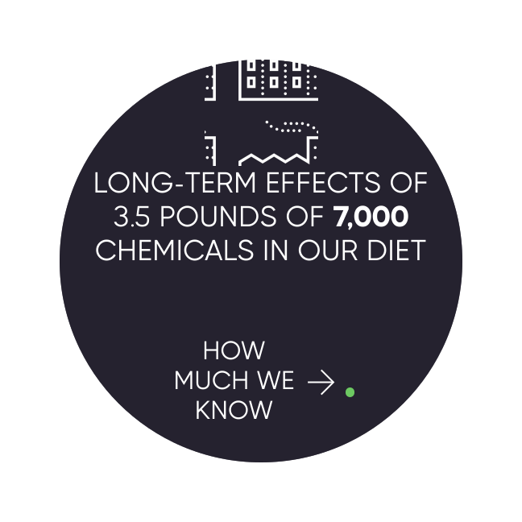
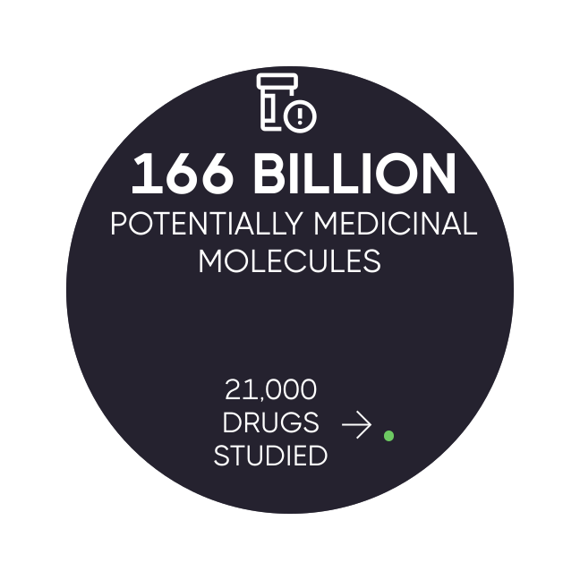

# Problem: You and Everyone You Love Will Suffer and Die

There are over [2 billion](https://www.george-health.com/global-health-challenge/) people suffering from chronic diseases.

Additionally, [150,000](https://www.weforum.org/agenda/2020/05/how-many-people-die-each-day-covid-19-coronavirus/) people die every single day by possibly preventable degenerative diseases. For perspective, this is equivalent to:

* [**FIFTY-ONE**](https://en.wikipedia.org/wiki/Casualties\_of\_the\_September\_11\_attacks) September 11th attacks every day
* [**NINE**](https://en.wikipedia.org/wiki/Casualties\_of\_the\_September\_11\_attacks) Holocausts every year

**Will throwing more money at the existing healthcare system save us?**

Since 2014, healthcare spending per person has been [increasing faster than ever](https://fred.stlouisfed.org/series/HLTHSCPCHCSA) faster than ever before.

Despite this additional spending, life expectancy has actually been \[declining]\(.. /assets/life-expectancy/life-expectancy-chart.png) since 2014.

The current system of clinical research, diagnosis, and treatment is  failing the billions of people are suffering from chronic diseases.

It takes over [10 years and 2.6 billion dollars](https://www.semanticscholar.org/paper/Innovation-in-the-pharmaceutical-industry%3A-New-of-DiMasiGrabowski/3275f31c072ac11c6ca7a5260bd535720f07df41) to bring a drug to market (including failed attempts). 
It costs [$41k](https://www.clinicalleader.com/doc/getting-a-handle-on-clinical-trial-costs-0001) per subject in Phase III clinical trials.

The high costs lead to:

**1. No Data on Unpatentable Molecules**

We still know next to nothing about the long-term effects of 99.9% of the 4 pounds of over [7,000](https://www.dailymail.co.uk/health/article-8757191/Are-additives-food-making-ill.html) different synthetic or natural compounds. This is because there's only sufficient incentive to research patentable molecules.

**2. Lack of Incentive to Discover Every Application of Off-Patent Treatments**

Thousands of drugs were found to work for other diseases after the patent expired. Unfortunately, there is no financial incentive to do any more research on them at this point.

**3. No Long-Term Outcome Data**

It's not financially feasible to collect a participant's data for years or decades. Thus, we don't know if the long-term effects of a drug are worse than the initial benefits.

**4. Negative Results Aren't Published**

Pharmaceutical companies tend to only report "positive" results. That leads to other companies wasting money repeating research on the same dead ends.

**5. Trials Exclude a Vast Majority of The Population**

One investigation found that only [14.5%](https://www.ncbi.nlm.nih.gov/pubmed/14628985) of patients with major depressive disorder fulfilled eligibility requirements for enrollment in an antidepressant trial. Furthermore, most patient sample sizes are very small and sometimes include only 20 people.

**6. We Only Know 0.000000002% of What is Left to be Researched**

We've only studied [0.000000002%](https://www.centerwatch.com/articles/12702-new-mit-study-puts-clinical-research-success-rate-at-14-percent) of the [166 billion](https://www.nature.com/articles/549445a) potential medicinal molecules.

